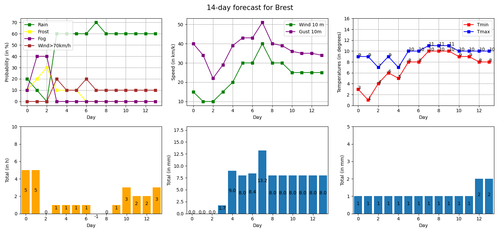

# Weather forecast for a French city  &#x26C5;

This Python script allows to get meteo forecast for a french city using requests to the Meteo Concept API.

You need to create an account to have access to Meteo Concept API and get your API key [here](https://api.meteo-concept.com/login).

## How to execute the program ?

```
python3 -B main.py location   # -B to ignore the generation of byte codes in the folder __pycache__
```   

The first argument "location" is the name of the French city for which you want to get the weather forecast.

Then you have to choose which information to get according to the following possibilities :  

```
Veuillez faire votre choix entre 1 et 8 :

 0 > Informations diverses sur la commune
 1 > Éphéméride pour un jour à venir (J+14 maximum)
 2 > Prévisions journalières sur les 14 prochains jours
 3 > Prévisions journalières pour un jour (J+14 maximum)
 4 > Prévisions par périodes de la journée sur les 14 prochains jours
 5 > Prévisions par périodes de la journée pour un jour (J+14 maximum)
 6 > Prévisions pour une période de la journée pour un jour (J+14 maximum)
 7 > Prévisions horaires pour les 12 prochaines heures
 8 > Données météorologiques d'une station à proximité
 q > Quitter
``` 

For the choice number 2, the script plot some datas on different graphics using Matplotlib : 


